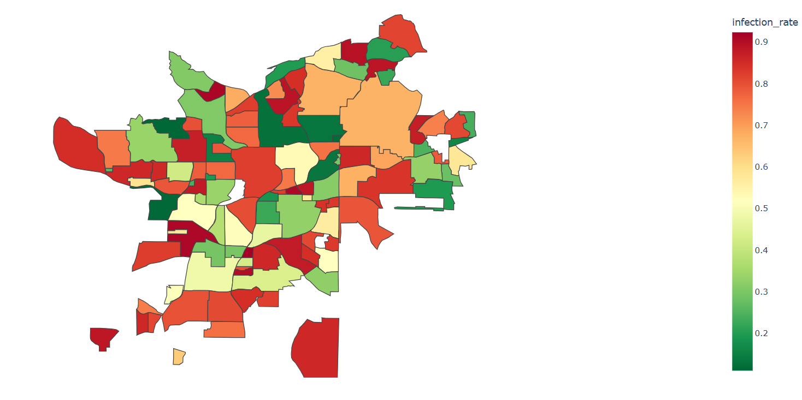

# 🧟 Zombie Outbreak Simulation – Atlanta

This project simulates a fictional zombie outbreak across different areas of Atlanta using probabilistic modeling and visualizes the results on a real geographic map.

It is built as a practice project while learning core deep learning concepts such as the sigmoid function, probability distributions, and simulation using NumPy.

---

## 📌 Overview

Each area in the city:
- Has a randomly assigned population
- Generates individual exposure scores
- Converts those scores into infection probabilities using the sigmoid function
- Simulates infections using random sampling (Bernoulli trials)
- Computes an overall infection rate
- Assigns a risk level based on that rate

The results are visualized on a map using Plotly.

---

## 🧠 Key Concepts Used

- Sigmoid function (probability mapping)
- Random normal distribution (`np.random.randn`)
- Bernoulli sampling for simulation
- Area-based bias (density-driven risk modeling)
- GeoJSON-based map visualization

---

## 🗺️ Visualization

Each region is colored based on infection severity:

- 🟢 Low Risk
- 🟡 Moderate Risk
- 🟠 High Risk
- 🔴 Critical

Hovering over a region shows:
- Name
- Population
- Number of infected individuals
- Infection rate
- Alert level

---

## 📸 Sample Output



---

## 📁 Project Structure

```
zombie_outbreak_city/
│
├── app.py               # Visualization (Plotly map)
├── simulation.py        # Core simulation logic
├── atlanta.geojson      # Geographic boundaries
├── requirements.txt
└── README.md
```

---

## ⚙️ Installation

Clone the repository and install dependencies:

```bash
git clone https://github.com/your-username/zombie_outbreak_city.git
cd zombie_outbreak_city
pip install -r requirements.txt
```

---

## ▶️ Run the Project

```bash
python app.py
```

This will open an interactive map in your browser.

---